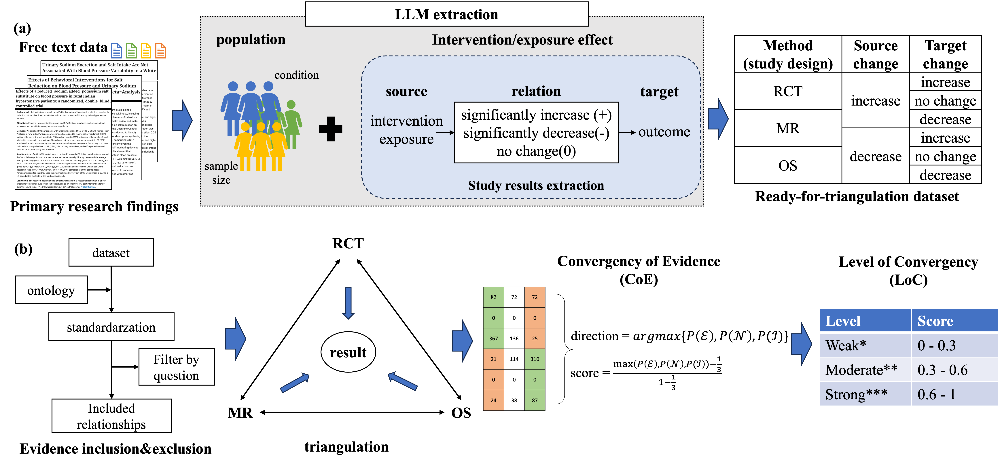

# LLM Evidence Triangulation

This is the official repository for the project **A Large Language Model Approach to Extracting Causal Evidence across Study Designs for Evidence Triangulation**.

This repository provides the official implementation of the paper **“A Large Language Model Approach to Extracting Causal Evidence across Study Designs for Evidence Triangulation.”** The project aims to automate the extraction of study design, exposure–outcome concepts, and relationships (e.g., effect direction, statistical significance) from biomedical abstracts. By combining multiple lines of evidence—randomized controlled trials (RCTs), observational studies (OSs), Mendelian randomization (MR), and more—our framework computes **Convergency of Evidence (CoE)** and **Level of Convergency (LoC)** to support more robust causal inference in epidemiology and public health.

Read our preprint on [medRxiv](https://www.medrxiv.org/content/10.1101/2024.03.18.24304457v3).



*Figure 1. Overall workflow of automatic evidence triangulation using LLM.*

---

## Background

Causal inference in biomedical research often requires synthesizing evidence from a variety of study designs, each with distinct potential biases. Traditional meta-analyses typically pool similar study types, while *evidence triangulation* aggregates results across **heterogeneous** designs—randomized controlled trials, observational studies, Mendelian randomization, and more—to assess whether each line of evidence converges on the same causal conclusion.

This work leverages **large language models (LLMs)** to:

- **Identify** study design, interventions/exposures, outcomes, effect directions, and statistical significance from biomedical abstracts.  
- **Compute** convergency metrics—Convergency of Evidence (CoE) and Level of Convergency (LoC)—to see whether RCTs, observational studies, and MR converge on a particular research question.

---

## Key Features

- **Prompt-Based Extraction**  
  Uses flexible LLMs to parse abstracts, identify exposures and outcomes, and extract effect directions.

- **Study Design Categorization**  
  Automatically labels each study as RCT, observational, MR, or meta-analysis/systematic review.

- **Two-Step Extraction Workflow**  
  Separates entity recognition (exposures and outcomes) from relationship extraction (direction, significance), improving handling of multi-endpoint or ambiguous abstracts.

- **Triangulation Metrics**  
  Implements a scoring system to assess how lines of evidence converge, offering both a *Convergency of Evidence (CoE)* score and a *Level of Convergency (LoC)* classification.

- **Scalable & Adaptive**  
  Easily extends to new publications; reflects how consensus evolves over time as additional data (and new study designs) appear in the literature.

---

## Installation

1. **Clone this repository**:
   ```bash
   git clone https://github.com/xuanyshi/llm-evidence-triangulation.git
   cd llm-evidence-triangulation
   ```

---

## Algorithm Overview

### 1. LLM-Powered Extraction
- **Two-Step:**
  1. **Entity Recognition:** Identify the key exposure(s) and outcome(s).
  2. **Relation Extraction:** Determine effect direction, p-value significance, and population size.

### 2. Study Design Classification
- The pipeline infers whether the paper is an RCT, observational, MR, or meta-analysis based on the abstract’s content.

### 3. Evidence Triangulation
- **Convergency of Evidence (CoE):** Tallies how many lines of evidence (from distinct designs) point to excitatory, inhibitory, or null effects.
- **Level of Convergency (LoC):** Categorizes the CoE score (e.g., weak, moderate, strong) to convey an at-a-glance measure of the overall consensus.

### 4. Optional Weighting
- Adjusts each study’s impact on CoE/LoC, e.g., by sample size or other quality indicators to reflect relative study robustness.

---

## Contributing

We welcome feedback, bug reports, and feature requests. Please open an issue or submit a pull request to improve any part of this pipeline, from data ingestion to triangulation scoring.

---

## References

1. Lawlor, D. A., Tilling, K., & Davey Smith, G. (2016). *Triangulation in aetiological epidemiology.* International Journal of Epidemiology, 45(6), 1866–1886.
2. Munafò, M. R., & Davey Smith, G. (2018). *Robust research needs many lines of evidence.* Nature, 553, 399–401.
3. Other references on knowledge extraction, large language models, and evidence synthesis as cited in the paper.
